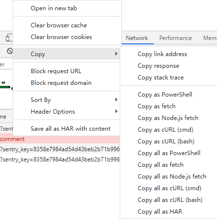

# V2 版本

V2,作用于浏览器上的插件

> 打通任脉 Chrome DevTools， Copy 选项

在 Chrome DevTools 调试时发现 Network 下的所有请求都可以被原样复制

Cookie、Headers、Body 都是可以被复制拿到



比如点击 Copy as fetch 后，粘贴在控制台即可发送请求

```javascript
fetch("https://www.baidu.com/sugrec?prod=pc_his&from=", {
  headers: {
    accept: "application/json, text/javascript, */*; q=0.01",
    "accept-language": "zh-CN,zh;q=0.9",
    "sec-ch-ua":
      '" Not;A Brand";v="99", "Google Chrome";v="91", "Chromium";v="91"',
    "sec-ch-ua-mobile": "?0",
    "sec-fetch-dest": "empty",
    "sec-fetch-mode": "cors",
    "sec-fetch-site": "same-origin",
  },
  referrer: "https://www.baidu.com/",
  referrerPolicy: "unsafe-url",
  body: null,
  method: "GET",
  mode: "cors",
  credentials: "include",
});
```

通过 Copy as fetch 获取登录、发帖的 Body 传参，以及 Headers 配置项

完成请求编写

<br>

> 打通督脉 Tampermonkey 编写插件

最开始做的在
Chrome DevTools > Sources > Snippets 中写临时脚本

但是 Snippets 的局限性太大

- 无法自己启动
- 无法刷新

<br>

编写一个 Chrome extensions 难度较大

无意间想起 Tampermonkey 可以自己编写插件

和当前业务逻辑非常贴合也非常简单

[编写第一个油猴脚本（Tamper monkey）](https://www.xiaoz.me/archives/11122)

<br>

> 小周天成

通过 Chrome DevTools 和 Tampermonkey 的配合

- 可自动登录
- 可自动清理内存（刷新）
  - 并发时会产生大量积压的请求，积压的请求一多内存就会爆掉
  - 网速慢和 CPU 配置不高也会爆

刷新记录：

当日最高记录 280W 回帖
实际可以更高，12G内存爆掉过几次

<br>

> 不足

1. 无法持久化登录、发送日志
2. 内存易爆
3. 论坛编码为 GBK，js 脚本无法解析 GBK
   - 代码里变量 `Code` 部分就是 GBK 编码后的内容，看上去比较奇怪
4. 